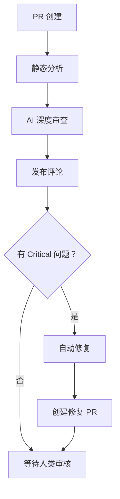

# AI 代码审查自动化

基于 gstack-review skill 的自动化代码审查系统，寻找能通过 CI 但在生产环境会爆炸的 bug。

## 🎯 功能特性

- ✅ **静态分析**: Flake8 + Black + Mypy
- ✅ **AI 深度审查**: 集成 gstack-review，寻找结构性 bug
- ✅ **自动评论**: 综合报告 + 行内评论
- ✅ **自动修复**: Critical 问题自动修复
- ✅ **GitHub 集成**: 无缝集成 PR 流程

## 🚀 快速开始

### 1. 配置 Secrets

在 GitHub 仓库设置中添加：

```
Settings → Secrets and variables → Actions

添加：
- LLM_API_KEY: 你的 LLM API 密钥
- LLM_API_URL: LLM API 地址（可选，默认 OpenAI）
```

### 2. 安装依赖

```bash
cd backend
pip install PyGithub requests
```

### 3. 创建测试 PR

```bash
# 创建测试分支
git checkout -b test/ai-review

# 做一些修改
echo "# Test" >> README.md
git add README.md
git commit -m "Test AI review"

# 推送
git push origin test/ai-review

# 在 GitHub 创建 PR，查看 Actions 触发
```

## 📊 工作流程



## 🔍 审查重点

### 高优先级（必须找出）

| 问题类型 | 说明 | 示例 |
|---------|------|------|
| N+1 查询 | 循环中查询数据库 | `for user in users: db.query(...)` |
| 竞态条件 | 并发访问共享资源 | read-modify-write |
| 信任边界 | 未验证的外部输入 | 直接使用用户输入 |
| 逃逸 bug | 异常未捕获 | 缺少 try-catch |
| 不变量破坏 | 关键状态被修改 | 并发修改状态 |
| 陈旧读取 | 缓存/数据库过期 | 读取旧数据 |
| 重试缺陷 | 没有指数退避 | 立即重试 |

### 中优先级

- 内存泄漏
- 索引缺失
- 死锁风险
- 幂等性问题

### 忽略项

- 变量命名
- 代码格式
- 注释风格
- TODO 注释

## 📝 输出示例

### 综合评论

```markdown
## 🤖 AI 代码审查报告

**结论**: ⚠️ Needs Work
**总结**: 发现 2 个 Critical 问题

### 🚨 Critical 问题

1. N+1 查询 - backend/app/api/articles.py:45
2. 信任边界违规 - backend/app/api/comments.py:78
```

### 行内评论

```markdown
**🔴 N+1 查询**

循环中查询数据库，会导致性能问题

**建议**: 使用批量查询优化
```

## 🤖 自动修复

当发现 Critical 问题时：

1. AI 自动应用修复
2. 创建分支 `ai-fix/pr-{number}`
3. 提交修复代码
4. 创建修复 PR
5. 在原 PR 中评论通知

## 📈 配置选项

### 自定义审查规则

编辑 `.github/scripts/ai_code_review.py`：

```python
self.high_priority_checks = [
    "N+1 查询",
    "竞态条件",
    # 添加自定义检查
]
```

### 调整触发条件

编辑 `.github/workflows/ai-code-review.yml`：

```yaml
on:
  pull_request:
    branches: [main, develop]  # 自定义分支
```

## 🔍 故障排查

### AI 审查失败

```bash
# 检查 Secret
echo $LLM_API_KEY

# 测试 API
curl -X POST $LLM_API_URL \
  -H "Authorization: Bearer $LLM_API_KEY"
```

### 查看详细日志

```
Actions → AI Code Review → 最新运行 → 查看日志
```

## 📚 文档

- [完整配置指南](.github/AI-CODE-REVIEW-GUIDE.md)
- [gstack-review skill](.trae/skills/gstack-review/SKILL.md)

## 🎯 最佳实践

1. **早审查，勤审查**: 每个 PR 都触发
2. **人类审核不可替代**: AI 是辅助，人类是关键
3. **持续优化**: 根据误报调整 prompt
4. **记录技术债务**: Medium/Low问题记录到Issue

## 📊 效果指标

建议跟踪：

- 审查覆盖率 >90%
- Critical 问题发现数（周）
- 自动修复成功率 >60%
- 平均审查时间 <10 分钟

---

*基于 gstack-review skill 构建 | 维护者：AI SRE Team*
